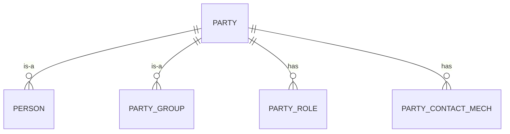

# Woche 2: Datenmodell & API-Design - Implementierungsguide

**Zeitraum:** Woche 2 (5 Arbeitstage)  
**Ziel:** Datenmodell definieren, PostgreSQL-Schema erstellen, API-Design abschließen  
**Status:** 🔄 Bereit zur Implementierung

---

## Übersicht

Woche 2 legt das Fundament für die gesamte Party-Service-Implementierung:
- **Datenmodell:** Identifikation und Modellierung der ~30 Party-Tabellen aus OFBiz
- **Datenbankschema:** PostgreSQL-Schema mit Flyway Migrations
- **API-Design:** OpenAPI 3.0 Spezifikation mit 30+ REST Endpoints
- **Event-Schema:** Kafka Event-Definitionen mit Avro
- **DTOs:** Data Transfer Objects für API-Kommunikation

---

## Tag 1-2: Datenmodell-Analyse (2 Tage)

### Aufgabe 1.1: Party-Tabellen aus OFBiz identifizieren

**Ziel:** Alle relevanten Party-Tabellen aus der OFBiz-Datenbank identifizieren und dokumentieren.

**Vorgehen:**
1. Neo4j-Analyse nutzen, um Entity-Definitionen zu finden
2. OFBiz Entity-XML-Dateien analysieren
3. Tabellenstruktur dokumentieren
4. Beziehungen zwischen Tabellen kartieren

**Prompt 1: Neo4j-Analyse für Party-Entities**
```
Analysiere die OFBiz Party-Entities mit Neo4j:

1. Finde alle Entity-Definitionen im Party-Modul:
   - Nutze den Neo4j-MCP-Server
   - Suche nach Klassen in org.apache.ofbiz.party
   - Identifiziere Entity-Definitionen (XML-basiert)

2. Erstelle eine Liste aller Party-Tabellen mit:
   - Tabellenname
   - Primärschlüssel
   - Wichtige Felder
   - Beziehungen zu anderen Tabellen

3. Priorisiere die Kern-Entities:
   - Party (Basis-Entity)
   - Person (extends Party)
   - PartyGroup (extends Party)
   - ContactMech (Kontaktmechanismen)
   - PostalAddress, TelecomNumber, EmailAddress
   - PartyRole (Rollen)
   - PartyRelationship (Beziehungen)

4. Dokumentiere in einer Markdown-Tabelle:
   | Tabelle | Typ | Felder | Beziehungen | Priorität |
   |---------|-----|--------|-------------|-----------|

Speichere das Ergebnis in:
microservices/party-service/docs/PARTY_ENTITIES_ANALYSIS.md
```

**Erwartetes Ergebnis:**
- Dokumentation aller ~30 Party-Tabellen
- Klare Priorisierung (Kern-Entities vs. erweiterte Entities)
- Verständnis der Datenstruktur

---

### Aufgabe 1.2: ER-Diagramm erstellen

**Ziel:** Visuelles Datenmodell für besseres Verständnis und Kommunikation.

**Prompt 2: ER-Diagramm mit Mermaid**
```
Erstelle ein ER-Diagramm für das Party-Datenmodell:

1. Nutze Mermaid-Syntax für das Diagramm
2. Zeige die wichtigsten Entities:
   - Party (Abstract)
   - Person, PartyGroup
   - ContactMech (Abstract)
   - PostalAddress, TelecomNumber, EmailAddress
   - PartyRole
   - PartyRelationship
   - PartyContactMech (Junction Table)

3. Zeige Beziehungen:
   - 1:1, 1:N, N:M
   - Vererbung (IS-A)
   - Assoziationen

4. Füge Kardinalitäten hinzu

Erstelle zwei Dateien:
1. microservices/party-service/docs/PARTY_ER_DIAGRAM.md (Mermaid-Code)
2. microservices/party-service/docs/PARTY_DATA_MODEL.md (Beschreibung)

Beispiel Mermaid-Syntax:

```

**Erwartetes Ergebnis:**
- Visuelles ER-Diagramm (Mermaid)
- Dokumentation des Datenmodells
- Klare Verständnis der Beziehungen

---

## Tag 2-3: PostgreSQL-Schema & Migrations (1.5 Tage)

### Aufgabe 2.1: Flyway Migrations erstellen

**Ziel:** PostgreSQL-Schema mit Flyway Migrations definieren.

**Prompt 3: Flyway Migration V1 - Basis-Tabellen**
```
Erstelle die erste Flyway Migration für Party-Basis-Tabellen:

Datei: src/main/resources/db/migration/V1__create_party_base_tables.sql

Erstelle folgende Tabellen:
1. party (Basis-Tabelle)
   - party_id VARCHAR(20) PRIMARY KEY
   - party_type_id VARCHAR(20) NOT NULL
   - status_id VARCHAR(20)
   - created_date TIMESTAMP DEFAULT CURRENT_TIMESTAMP
   - created_by VARCHAR(20)
   - last_modified_date TIMESTAMP
   - last_modified_by VARCHAR(20)

2. person (extends party)
   - party_id VARCHAR(20) PRIMARY KEY REFERENCES party(party_id)
   - salutation VARCHAR(20)
   - first_name VARCHAR(100)
   - middle_name VARCHAR(100)
   - last_name VARCHAR(100)
   - personal_title VARCHAR(100)
   - suffix VARCHAR(20)
   - nickname VARCHAR(100)
   - gender VARCHAR(1)
   - birth_date DATE
   - marital_status VARCHAR(1)

3. party_group (extends party)
   - party_id VARCHAR(20) PRIMARY KEY REFERENCES party(party_id)
   - group_name VARCHAR(100) NOT NULL
   - group_name_local VARCHAR(100)
   - office_site_name VARCHAR(100)
   - annual_revenue DECIMAL(18,2)
   - num_employees BIGINT
   - ticker_symbol VARCHAR(10)
   - comments TEXT

Best Practices:
- Nutze VARCHAR statt CHAR für Flexibilität
- Füge created_date/last_modified_date für Auditing hinzu
- Nutze REFERENCES für Foreign Keys
- Füge Kommentare für komplexe Felder hinzu

Speichere in:
microservices/party-service/src/main/resources/db/migration/V1__create_party_base_tables.sql
```

**Prompt 4: Flyway Migration V2 - ContactMech-Tabellen**
```
Erstelle die zweite Flyway Migration für ContactMech-Tabellen:

Datei: src/main/resources/db/migration/V2__create_contact_mech_tables.sql

Erstelle folgende Tabellen:
1. contact_mech (Basis-Tabelle)
   - contact_mech_id VARCHAR(20) PRIMARY KEY
   - contact_mech_type_id VARCHAR(20) NOT NULL
   - info_string VARCHAR(255)

2. postal_address (extends contact_mech)
   - contact_mech_id VARCHAR(20) PRIMARY KEY REFERENCES contact_mech(contact_mech_id)
   - to_name VARCHAR(100)
   - attn_name VARCHAR(100)
   - address1 VARCHAR(255) NOT NULL
   - address2 VARCHAR(255)
   - city VARCHAR(100)
   - state_province_geo_id VARCHAR(20)
   - postal_code VARCHAR(20)
   - country_geo_id VARCHAR(20)
   - latitude DECIMAL(10,6)
   - longitude DECIMAL(10,6)

3. telecom_number (extends contact_mech)
   - contact_mech_id VARCHAR(20) PRIMARY KEY REFERENCES contact_mech(contact_mech_id)
   - country_code VARCHAR(3)
   - area_code VARCHAR(3)
   - contact_number VARCHAR(15) NOT NULL
   - extension VARCHAR(10)

4. party_contact_mech (Junction Table)
   - party_id VARCHAR(20) REFERENCES party(party_id)
   - contact_mech_id VARCHAR(20) REFERENCES contact_mech(contact_mech_id)
   - from_date TIMESTAMP NOT NULL
   - thru_date TIMESTAMP
   - role_type_id VARCHAR(20)
   - allow_solicitation VARCHAR(1)
   - extension VARCHAR(10)
   - comments TEXT
   - PRIMARY KEY (party_id, contact_mech_id, from_date)

Speichere in:
microservices/party-service/src/main/resources/db/migration/V2__create_contact_mech_tables.sql
```

**Prompt 5: Flyway Migration V3 - Rollen & Beziehungen**
```
Erstelle die dritte Flyway Migration für Rollen und Beziehungen:

Datei: src/main/resources/db/migration/V3__create_role_relationship_tables.sql

Erstelle folgende Tabellen:
1. party_role
   - party_id VARCHAR(20) REFERENCES party(party_id)
   - role_type_id VARCHAR(20) NOT NULL
   - from_date TIMESTAMP DEFAULT CURRENT_TIMESTAMP
   - thru_date TIMESTAMP
   - PRIMARY KEY (party_id, role_type_id)

2. party_relationship
   - party_id_from VARCHAR(20) REFERENCES party(party_id)
   - party_id_to VARCHAR(20) REFERENCES party(party_id)
   - role_type_id_from VARCHAR(20)
   - role_type_id_to VARCHAR(20)
   - party_relationship_type_id VARCHAR(20) NOT NULL
   - from_date TIMESTAMP NOT NULL
   - thru_date TIMESTAMP
   - status_id VARCHAR(20)
   - relationship_name VARCHAR(100)
   - security_group_id VARCHAR(20)
   - priority_type_id VARCHAR(20)
   - comments TEXT
   - PRIMARY KEY (party_id_from, party_id_to, role_type_id_from, role_type_id_to, from_date)

Speichere in:
microservices/party-service/src/main/resources/db/migration/V3__create_role_relationship_tables.sql
```

**Prompt 6: Flyway Migration V4 - Indizes**
```
Erstelle die vierte Flyway Migration für Performance-Indizes:

Datei: src/main/resources/db/migration/V4__create_indexes.sql

Erstelle Indizes für häufige Queries:

1. Party-Suche:
   CREATE INDEX idx_party_type ON party(party_type_id);
   CREATE INDEX idx_party_status ON party(status_id);
   CREATE INDEX idx_person_name ON person(last_name, first_name);
   CREATE INDEX idx_party_group_name ON party_group(group_name);

2. ContactMech-Suche:
   CREATE INDEX idx_contact_mech_type ON contact_mech(contact_mech_type_id);
   CREATE INDEX idx_postal_address_city ON postal_address(city);
   CREATE INDEX idx_postal_address_postal_code ON postal_address(postal_code);
   CREATE INDEX idx_telecom_number ON telecom_number(contact_number);

3. Beziehungen:
   CREATE INDEX idx_party_contact_mech_party ON party_contact_mech(party_id);
   CREATE INDEX idx_party_contact_mech_contact ON party_contact_mech(contact_mech_id);
   CREATE INDEX idx_party_role_party ON party_role(party_id);
   CREATE INDEX idx_party_role_type ON party_role(role_type_id);
   CREATE INDEX idx_party_relationship_from ON party_relationship(party_id_from);
   CREATE INDEX idx_party_relationship_to ON party_relationship(party_id_to);

4. Zeitbasierte Queries:
   CREATE INDEX idx_party_created_date ON party(created_date);
   CREATE INDEX idx_party_contact_mech_dates ON party_contact_mech(from_date, thru_date);

Speichere in:
microservices/party-service/src/main/resources/db/migration/V4__create_indexes.sql
```

**Erwartetes Ergebnis:**
- 4 Flyway Migration-Dateien
- Vollständiges PostgreSQL-Schema
- Performance-Indizes für häufige Queries

---

## Tag 3-4: API-Design (1.5 Tage)

### Aufgabe 3.1: OpenAPI 3.0 Spezifikation

**Ziel:** Vollständige REST API-Spezifikation mit 30+ Endpoints.

**Prompt 7: OpenAPI Spezifikation - Party Management**
```
Erstelle eine OpenAPI 3.0 Spezifikation für den Party Service:

Datei: microservices/party-service/src/main/resources/openapi/party-service-api.yaml

Struktur:
1. Metadata:
   - Title: Party Service API
   - Version: 1.0.0
   - Description: Microservice für Party-Management
   - Base URL: /api/v1

2. Party Management Endpoints (8):
   GET    /parties              - Liste aller Parties (mit Pagination)
   GET    /parties/{id}         - Party Details
   POST   /parties              - Neue Party erstellen
   PUT    /parties/{id}         - Party aktualisieren
   DELETE /parties/{id}         - Party löschen
   GET    /parties/search       - Party suchen (Query-Parameter)
   GET    /parties/{id}/roles   - Party Rollen
   POST   /parties/{id}/roles   - Rolle zuweisen

3. Schemas definieren:
   - PartyDTO (mit discriminator für Person/PartyGroup)
   - PersonDTO (extends PartyDTO)
   - PartyGroupDTO (extends PartyDTO)
   - PartyRoleDTO
   - PagedResponse<T>
   - ErrorResponse

4. Request/Response-Beispiele hinzufügen

5. Security-Schema (Bearer Token):
   securitySchemes:
     bearerAuth:
       type: http
       scheme: bearer
       bearerFormat: JWT

Best Practices:
- Nutze $ref für wiederverwendbare Schemas
- Füge description für alle Felder hinzu
- Definiere Validierungsregeln (required, minLength, pattern)
- Füge Beispiele hinzu

Speichere in:
microservices/party-service/src/main/resources/openapi/party-service-api.yaml
```

**Prompt 8: OpenAPI Spezifikation - Contact Management**
```
Erweitere die OpenAPI Spezifikation um Contact Management:

Füge hinzu zu: microservices/party-service/src/main/resources/openapi/party-service-api.yaml

Contact Management Endpoints (8):
   GET    /parties/{id}/contacts           - Alle Kontakte
   POST   /parties/{id}/contacts           - Kontakt hinzufügen
   PUT    /parties/{id}/contacts/{cid}     - Kontakt aktualisieren
   DELETE /parties/{id}/contacts/{cid}     - Kontakt löschen
   GET    /parties/{id}/addresses          - Adressen
   GET    /parties/{id}/phones             - Telefonnummern
   GET    /parties/{id}/emails             - E-Mail-Adressen
   POST   /parties/{id}/contacts/validate  - Kontakt validieren

Schemas:
   - ContactMechDTO (mit discriminator)
   - PostalAddressDTO (extends ContactMechDTO)
   - TelecomNumberDTO (extends ContactMechDTO)
   - EmailAddressDTO (extends ContactMechDTO)
   - PartyContactMechDTO

Beispiel PostalAddressDTO:
```yaml
PostalAddressDTO:
  allOf:
    - $ref: '#/components/schemas/ContactMechDTO'
    - type: object
      required:
        - address1
        - city
      properties:
        toName:
          type: string
          maxLength: 100
        address1:
          type: string
          maxLength: 255
          example: "123 Main Street"
        city:
          type: string
          maxLength: 100
          example: "San Francisco"
        postalCode:
          type: string
          pattern: '^\d{5}(-\d{4})?$'
          example: "94102"
```
```

**Prompt 9: OpenAPI Spezifikation - Relationships & Batch**
```
Erweitere die OpenAPI Spezifikation um Relationships und Batch-Operationen:

Füge hinzu zu: microservices/party-service/src/main/resources/openapi/party-service-api.yaml

Party Relationships Endpoints (6):
   GET    /parties/{id}/relationships      - Beziehungen
   POST   /parties/{id}/relationships      - Beziehung erstellen
   DELETE /parties/{id}/relationships/{rid} - Beziehung löschen
   GET    /relationships/types             - Beziehungstypen
   GET    /parties/{id}/children           - Untergeordnete Parties
   GET    /parties/{id}/parents            - Übergeordnete Parties

Person & PartyGroup Endpoints (4):
   POST   /persons              - Person erstellen
   PUT    /persons/{id}         - Person aktualisieren
   POST   /party-groups         - PartyGroup erstellen
   PUT    /party-groups/{id}    - PartyGroup aktualisieren

Batch Operations Endpoints (4):
   POST   /parties/batch        - Mehrere Parties erstellen
   PUT    /parties/batch        - Mehrere Parties aktualisieren
   POST   /parties/import       - Parties importieren (CSV/JSON)
   GET    /parties/export       - Parties exportieren (CSV/JSON)

Schemas:
   - PartyRelationshipDTO
   - RelationshipTypeDTO
   - BatchCreateRequest
   - BatchUpdateRequest
   - ImportRequest
   - ExportResponse

Gesamt: 30+ Endpoints
```

**Erwartetes Ergebnis:**
- Vollständige OpenAPI 3.0 Spezifikation
- 30+ REST Endpoints dokumentiert
- Alle Schemas definiert
- Request/Response-Beispiele

---

### Aufgabe 3.2: DTOs definieren

**Ziel:** Java DTOs für API-Kommunikation erstellen.

**Prompt 10: Basis-DTOs erstellen**
```
Erstelle die Basis-DTOs für den Party Service:

1. PartyDTO.java (Abstract Base)
   - Nutze Jackson für JSON-Serialisierung
   - Nutze Bean Validation (@NotNull, @Size, etc.)
   - Füge JavaDoc hinzu
   - Implementiere equals/hashCode/toString

Datei: src/main/java/org/apache/ofbiz/party/microservice/application/dto/PartyDTO.java

```java
package org.apache.ofbiz.party.microservice.application.dto;

import com.fasterxml.jackson.annotation.JsonSubTypes;
import com.fasterxml.jackson.annotation.JsonTypeInfo;
import jakarta.validation.constraints.NotBlank;
import jakarta.validation.constraints.Size;
import lombok.Data;
import lombok.NoArgsConstructor;
import lombok.AllArgsConstructor;
import lombok.experimental.SuperBuilder;

import java.time.LocalDateTime;

/**
 * Base DTO for Party entities.
 * Uses Jackson polymorphism for Person and PartyGroup subtypes.
 */
@Data
@NoArgsConstructor
@AllArgsConstructor
@SuperBuilder
@JsonTypeInfo(
    use = JsonTypeInfo.Id.NAME,
    include = JsonTypeInfo.As.PROPERTY,
    property = "partyType"
)
@JsonSubTypes({
    @JsonSubTypes.Type(value = PersonDTO.class, name = "PERSON"),
    @JsonSubTypes.Type(value = PartyGroupDTO.class, name = "PARTY_GROUP")
})
public abstract class PartyDTO {
    
    @Size(max = 20)
    private String partyId;
    
    @NotBlank
    @Size(max = 20)
    private String partyType;
    
    @Size(max = 20)
    private String statusId;
    
    private LocalDateTime createdDate;
    
    @Size(max = 20)
    private String createdBy;
    
    private LocalDateTime lastModifiedDate;
    
    @Size(max = 20)
    private String lastModifiedBy;
}
```

2. PersonDTO.java
3. PartyGroupDTO.java
4. ContactMechDTO.java (Abstract Base)
5. PostalAddressDTO.java
6. TelecomNumberDTO.java
7. EmailAddressDTO.java

Erstelle alle DTOs in:
microservices/party-service/src/main/java/org/apache/ofbiz/party/microservice/application/dto/

Best Practices:
- Nutze Lombok (@Data, @SuperBuilder)
- Nutze Bean Validation
- Nutze Jackson Annotations für Polymorphismus
- Füge JavaDoc hinzu
```

**Prompt 11: Weitere DTOs erstellen**
```
Erstelle weitere DTOs für Rollen, Beziehungen und Responses:

1. PartyRoleDTO.java
2. PartyRelationshipDTO.java
3. PartyContactMechDTO.java
4. PagedResponseDTO.java (Generic)
5. ErrorResponseDTO.java

Beispiel PagedResponseDTO:
```java
package org.apache.ofbiz.party.microservice.application.dto;

import lombok.AllArgsConstructor;
import lombok.Builder;
import lombok.Data;
import lombok.NoArgsConstructor;

import java.util.List;

/**
 * Generic DTO for paginated responses.
 *
 * @param <T> Type of content
 */
@Data
@NoArgsConstructor
@AllArgsConstructor
@Builder
public class PagedResponseDTO<T> {
    
    private List<T> content;
    private int page;
    private int size;
    private long totalElements;
    private int totalPages;
    private boolean first;
    private boolean last;
}
```

Erstelle alle DTOs in:
microservices/party-service/src/main/java/org/apache/ofbiz/party/microservice/application/dto/
```

**Erwartetes Ergebnis:**
- ~12 DTO-Klassen
- Vollständige Bean Validation
- Jackson-Polymorphismus für Vererbung
- Lombok für Boilerplate-Reduktion

---

## Tag 4-5: Event-Schema & Test-Daten (1 Tag)

### Aufgabe 4.1: Kafka Event-Schema definieren

**Ziel:** Event-Schema für asynchrone Kommunikation definieren.

**Prompt 12: Kafka Event-DTOs erstellen**
```
Erstelle Event-DTOs für Kafka-Publishing:

1. PartyCreatedEvent.java
2. PartyUpdatedEvent.java
3. PartyDeletedEvent.java
4. PartyRoleAssignedEvent.java
5. PartyRoleRemovedEvent.java
6. ContactMechAddedEvent.java
7. ContactMechUpdatedEvent.java
8. PartyRelationshipCreatedEvent.java

Basis-Struktur für Events:
```java
package org.apache.ofbiz.party.microservice.infrastructure.messaging.event;

import lombok.AllArgsConstructor;
import lombok.Builder;
import lombok.Data;
import lombok.NoArgsConstructor;

import java.time.LocalDateTime;

/**
 * Event published when a new Party is created.
 */
@Data
@NoArgsConstructor
@AllArgsConstructor
@Builder
public class PartyCreatedEvent {
    
    private String eventId;
    private String partyId;
    private String partyType;
    private LocalDateTime timestamp;
    private String createdBy;
    
    // Optional: Full party data
    private String payload; // JSON string
}
```

Best Practices:
- Füge eventId (UUID) hinzu für Idempotenz
- Füge timestamp hinzu
- Füge correlation-ID hinzu für Tracing
- Halte Events klein (nur IDs + wichtige Felder)
- Optional: Füge payload für vollständige Daten hinzu

Erstelle alle Events in:
microservices/party-service/src/main/java/org/apache/ofbiz/party/microservice/infrastructure/messaging/event/
```

**Prompt 13: Kafka Topics Konfiguration**
```
Definiere Kafka Topics in application.yml:

Füge hinzu zu: src/main/resources/application.yml

```yaml
party:
  kafka:
    topics:
      party-created: "party.created"
      party-updated: "party.updated"
      party-deleted: "party.deleted"
      party-role-assigned: "party.role.assigned"
      party-role-removed: "party.role.removed"
      contact-added: "party.contact.added"
      contact-updated: "party.contact.updated"
      relationship-created: "party.relationship.created"
    
    # Topic-Konfiguration
    partitions: 3
    replication-factor: 1
    retention-ms: 604800000  # 7 Tage
```

Erstelle auch eine Dokumentation:
microservices/party-service/docs/KAFKA_EVENTS.md

Dokumentiere für jedes Event:
- Event-Name
- Topic
- Payload-Struktur
- Wann wird es publiziert?
- Wer konsumiert es?
- Beispiel-Payload
```

**Erwartetes Ergebnis:**
- 8 Event-DTO-Klassen
- Kafka Topics konfiguriert
- Event-Dokumentation

---

### Aufgabe 4.2: Test-Daten vorbereiten

**Ziel:** Test-Daten für Entwicklung und Tests.

**Prompt 14: Test-Daten Migration erstellen**
```
Erstelle eine Flyway Migration mit Test-Daten:

Datei: src/main/resources/db/migration/V99__test_data.sql

Füge Test-Daten hinzu:
1. 5 Personen (verschiedene Szenarien)
2. 3 PartyGroups (Firmen)
3. 10 Kontaktmechanismen (Adressen, Telefone, E-Mails)
4. 5 Party-Rollen
5. 3 Party-Beziehungen

Beispiel:
```sql
-- Test Persons
INSERT INTO party (party_id, party_type_id, status_id, created_date, created_by)
VALUES 
    ('PERSON_001', 'PERSON', 'PARTY_ENABLED', CURRENT_TIMESTAMP, 'SYSTEM'),
    ('PERSON_002', 'PERSON', 'PARTY_ENABLED', CURRENT_TIMESTAMP, 'SYSTEM'),
    ('PERSON_003', 'PERSON', 'PARTY_DISABLED', CURRENT_TIMESTAMP, 'SYSTEM');

INSERT INTO person (party_id, first_name, last_name, gender, birth_date)
VALUES 
    ('PERSON_001', 'John', 'Doe', 'M', '1980-01-15'),
    ('PERSON_002', 'Jane', 'Smith', 'F', '1985-05-20'),
    ('PERSON_003', 'Bob', 'Johnson', 'M', '1990-12-10');

-- Test PartyGroups
INSERT INTO party (party_id, party_type_id, status_id, created_date, created_by)
VALUES 
    ('COMPANY_001', 'PARTY_GROUP', 'PARTY_ENABLED', CURRENT_TIMESTAMP, 'SYSTEM'),
    ('COMPANY_002', 'PARTY_GROUP', 'PARTY_ENABLED', CURRENT_TIMESTAMP, 'SYSTEM');

INSERT INTO party_group (party_id, group_name, annual_revenue, num_employees)
VALUES 
    ('COMPANY_001', 'Acme Corporation', 1000000.00, 50),
    ('COMPANY_002', 'Tech Innovations Inc', 5000000.00, 200);

-- Test Addresses
INSERT INTO contact_mech (contact_mech_id, contact_mech_type_id)
VALUES 
    ('ADDR_001', 'POSTAL_ADDRESS'),
    ('ADDR_002', 'POSTAL_ADDRESS');

INSERT INTO postal_address (contact_mech_id, address1, city, postal_code, country_geo_id)
VALUES 
    ('ADDR_001', '123 Main Street', 'San Francisco', '94102', 'USA'),
    ('ADDR_002', '456 Oak Avenue', 'New York', '10001', 'USA');

-- Link Contacts to Parties
INSERT INTO party_contact_mech (party_id, contact_mech_id, from_date)
VALUES 
    ('PERSON_001', 'ADDR_001', CURRENT_TIMESTAMP),
    ('COMPANY_001', 'ADDR_002', CURRENT_TIMESTAMP);
```

Hinweis: Diese Migration sollte nur im dev-Profil laufen!

Konfiguriere in application-dev.yml:
```yaml
spring:
  flyway:
    locations: classpath:db/migration
```
```

**Erwartetes Ergebnis:**
- Test-Daten für Entwicklung
- Realistische Szenarien abgedeckt
- Nur im dev-Profil aktiv

---

## Zusammenfassung & Deliverables

### Deliverables Woche 2

**Dokumentation:**
- ✅ PARTY_ENTITIES_ANALYSIS.md - Alle ~30 Tabellen dokumentiert
- ✅ PARTY_ER_DIAGRAM.md - ER-Diagramm (Mermaid)
- ✅ PARTY_DATA_MODEL.md - Datenmodell-Beschreibung
- ✅ KAFKA_EVENTS.md - Event-Dokumentation

**Datenbank:**
- ✅ V1__create_party_base_tables.sql
- ✅ V2__create_contact_mech_tables.sql
- ✅ V3__create_role_relationship_tables.sql
- ✅ V4__create_indexes.sql
- ✅ V99__test_data.sql (dev only)

**API-Design:**
- ✅ party-service-api.yaml - OpenAPI 3.0 Spezifikation (30+ Endpoints)
- ✅ ~12 DTO-Klassen (PartyDTO, PersonDTO, ContactMechDTO, etc.)
- ✅ 8 Event-DTO-Klassen

**Gesamt:**
- ~20 Dateien erstellt
- ~2000 Zeilen Code/SQL/YAML
- Vollständiges Datenmodell
- Vollständige API-Spezifikation

---

## Validierung & Tests

### Validierung nach Woche 2

**1. Datenbank-Schema testen:**
```bash
# Spring Boot starten (dev-Profil)
./gradlew :microservices:party-service:bootRun

# Flyway sollte alle Migrations ausführen
# H2 Console öffnen: http://localhost:8081/api/party/h2-console
# Tabellen prüfen: SELECT * FROM party;
```

**2. OpenAPI-Spezifikation validieren:**
```bash
# Swagger UI öffnen
# http://localhost:8081/api/party/swagger-ui.html

# Prüfe:
# - Alle 30+ Endpoints sichtbar
# - Schemas korrekt
# - Beispiele vorhanden
```

**3. DTOs kompilieren:**
```bash
# Build durchführen
./gradlew :microservices:party-service:build

# Sollte ohne Fehler durchlaufen
```

**4. Test-Daten prüfen:**
```sql
-- In H2 Console
SELECT COUNT(*) FROM party;  -- Sollte 5 sein
SELECT COUNT(*) FROM person;  -- Sollte 3 sein
SELECT COUNT(*) FROM party_group;  -- Sollte 2 sein
SELECT COUNT(*) FROM postal_address;  -- Sollte 2 sein
```

---

## Nächste Schritte (Woche 3)

Nach Abschluss von Woche 2 folgt Woche 3:
- JPA Entities implementieren
- Repositories erstellen
- Core Services implementieren
- Unit Tests schreiben

**Vorbereitung:**
- Datenmodell verstanden ✅
- API-Design abgeschlossen ✅
- Bereit für Implementierung ✅

---

## Tipps & Best Practices

### Datenmodell
- ✅ Halte dich an OFBiz-Namenskonventionen (party_id, nicht partyId)
- ✅ Nutze VARCHAR statt CHAR für Flexibilität
- ✅ Füge Auditing-Felder hinzu (created_date, last_modified_date)
- ✅ Nutze Foreign Keys für Referential Integrity

### API-Design
- ✅ Nutze REST-Best-Practices (GET/POST/PUT/DELETE)
- ✅ Nutze Pagination für Listen (page, size)
- ✅ Nutze HTTP-Status-Codes korrekt (200, 201, 400, 404, 500)
- ✅ Füge Validierung hinzu (Bean Validation)

### Events
- ✅ Halte Events klein (nur IDs + wichtige Felder)
- ✅ Füge eventId für Idempotenz hinzu
- ✅ Füge timestamp hinzu
- ✅ Dokumentiere Event-Schema

### Test-Daten
- ✅ Erstelle realistische Szenarien
- ✅ Decke Edge-Cases ab (null-Werte, leere Strings)
- ✅ Nur im dev-Profil aktiv

---

## Zeitplan Woche 2

| Tag | Aufgaben | Stunden | Status |
|-----|----------|---------|--------|
| **Tag 1** | Neo4j-Analyse, Entity-Dokumentation | 8h | 🔄 |
| **Tag 2** | ER-Diagramm, Flyway V1-V2 | 8h | 🔄 |
| **Tag 3** | Flyway V3-V4, OpenAPI Party/Contact | 8h | 🔄 |
| **Tag 4** | OpenAPI Relationships/Batch, DTOs | 8h | 🔄 |
| **Tag 5** | Event-Schema, Test-Daten, Validierung | 8h | 🔄 |
| **Gesamt** | | **40h** | **0%** |

---

## Fragen & Antworten

**Q: Warum Flyway statt Liquibase?**
A: Flyway ist einfacher, SQL-basiert, und gut für PostgreSQL geeignet.

**Q: Warum OpenAPI 3.0 statt Swagger 2.0?**
A: OpenAPI 3.0 ist der aktuelle Standard, besser strukturiert, mehr Features.

**Q: Warum DTOs statt direkt Entities?**
A: DTOs entkoppeln API von Datenmodell, ermöglichen Versionierung, bessere Kontrolle.

**Q: Warum Kafka Events?**
A: Asynchrone Kommunikation, Entkopplung, Event Sourcing, Audit-Trail.

**Q: Wie viele Tabellen werden migriert?**
A: ~30 Tabellen aus OFBiz Party-Modul, priorisiert nach Wichtigkeit.

---

**Erstellt:** 2026-01-21  
**Autor:** Roo AI (Party-PoC Mode)  
**Version:** 1.0  
**Status:** Bereit zur Implementierung
