# OFBiz Dependency Visualizations

Diese Datei enthält Visualisierungen der Abhängigkeiten zwischen OFBiz-Modulen zur Unterstützung der Service-Dekomposition.

## 1. Business-Module Dependency Graph

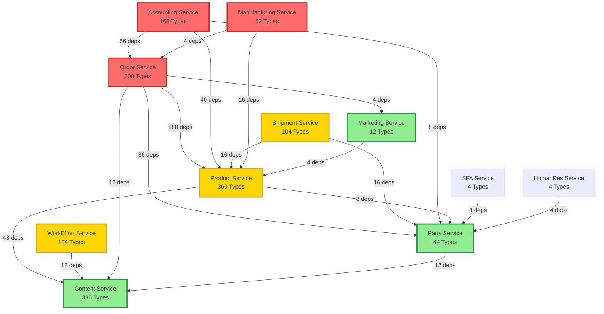

## 2. Framework Dependencies

```mermaid
graph TB
    %% Framework Layer
    Base[Base Framework<br/>1,572 Types]
    Entity[Entity Engine<br/>1,012 Types]
    Service[Service Engine<br/>620 Types]
    Widget[Widget Framework<br/>964 Types]
    WebApp[WebApp Framework<br/>372 Types]
    Security[Security<br/>56 Types]
    
    %% Business Layer
    Product[Product]
    Content[Content]
    Order[Order]
    Accounting[Accounting]
    Party[Party]
    Shipment[Shipment]
    WorkEffort[WorkEffort]
    
    %% Dependencies to Framework
    Product -->|1,196| Base
    Product -->|1,456| Entity
    Product -->|416| Service
    
    Content -->|1,460| Base
    Content -->|972| Entity
    Content -->|352| Service
    Content -->|96| Widget
    
    Order -->|884| Base
    Order -->|917| Entity
    Order -->|373| Service
    
    Accounting -->|724| Base
    Accounting -->|620| Entity
    Accounting -->|328| Service
    
    Party -->|220| Base
    Party -->|320| Entity
    Party -->|72| Service
    
    Shipment -->|436| Base
    Shipment -->|308| Entity
    Shipment -->|220| Service
    
    WorkEffort -->|292| Base
    WorkEffort -->|388| Entity
    WorkEffort -->|140| Service
    
    %% Styling
    classDef framework fill:#E0E0E0,stroke:#666,stroke-width:2px
    classDef business fill:#87CEEB,stroke:#4682B4,stroke-width:2px
    
    class Base,Entity,Service,Widget,WebApp,Security framework
    class Product,Content,Order,Accounting,Party,Shipment,WorkEffort business
```

## 3. Service Extraction Roadmap

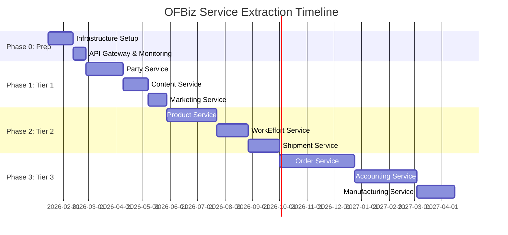

## 4. Bounded Context Map

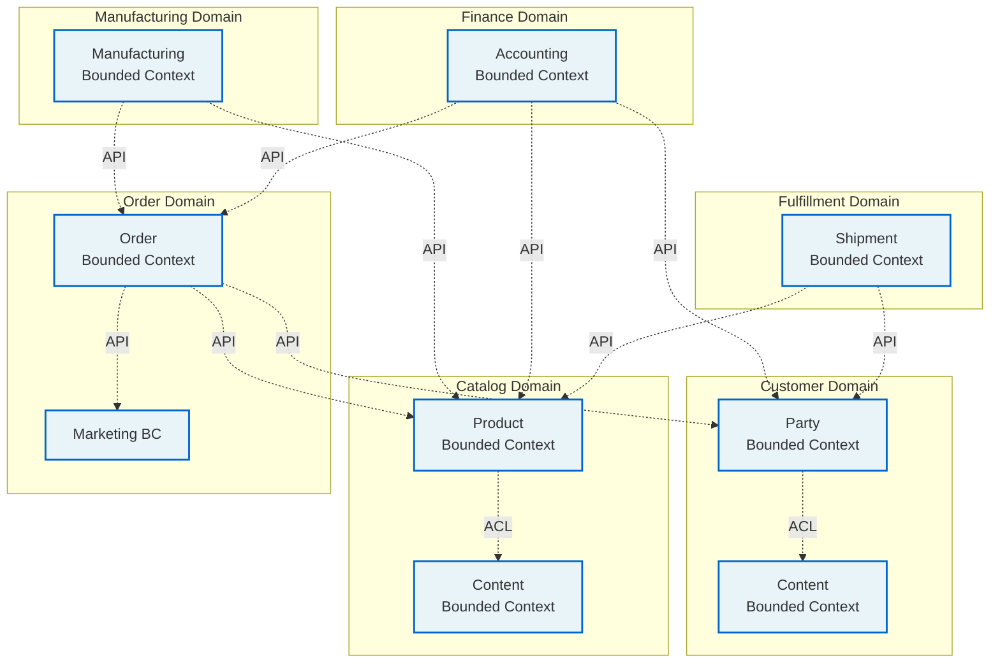

## 5. Data Flow Architecture

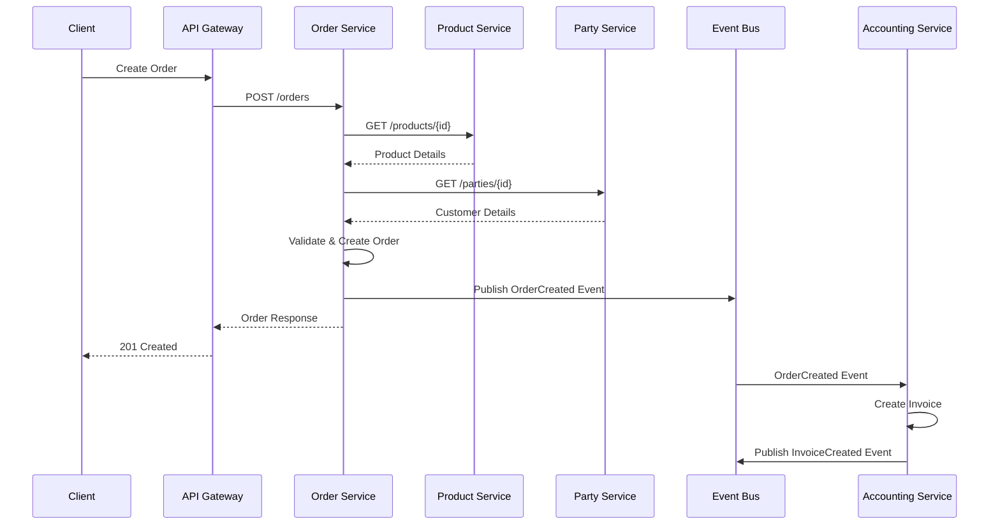

## 6. Service Complexity Matrix

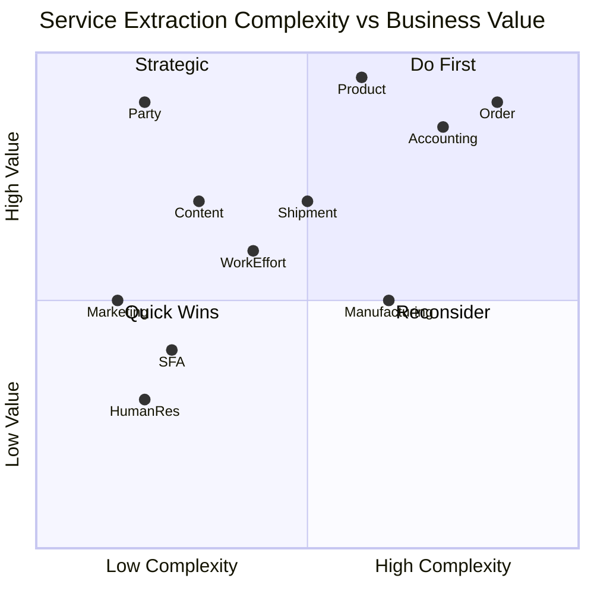

## 7. Anti-Corruption Layer Pattern

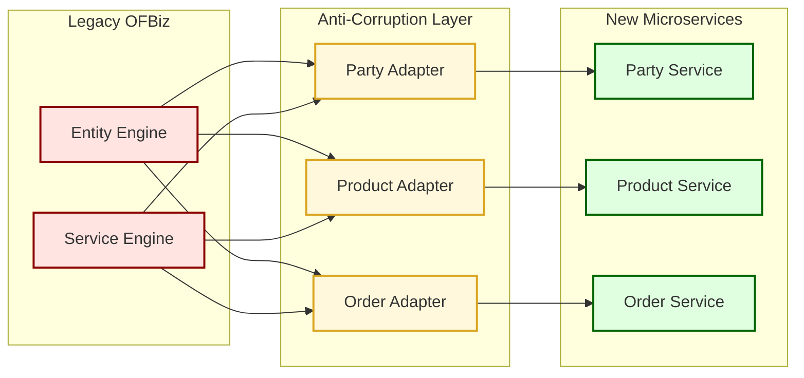

## 8. Event-Driven Architecture

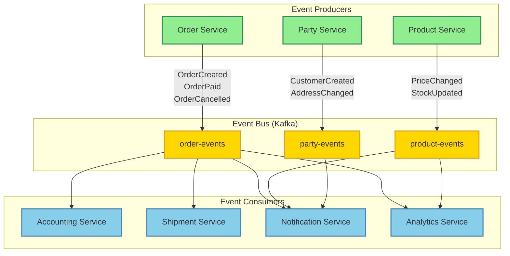

## 9. Saga Pattern für Order Processing

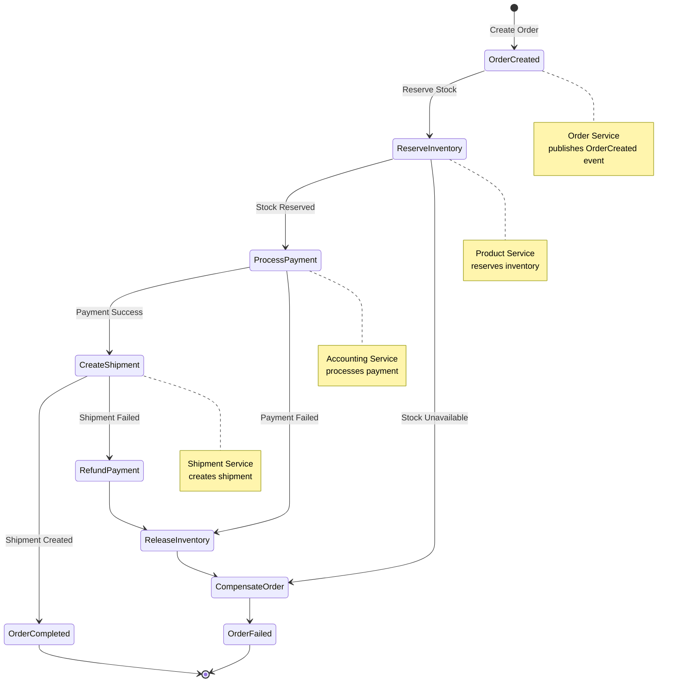

## 10. Deployment Architecture

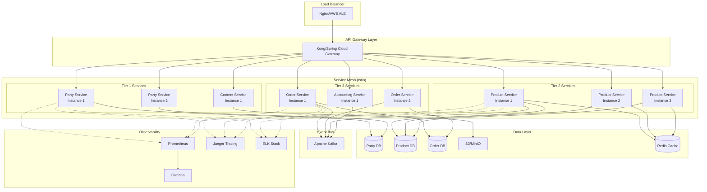

## 11. Migration Phases Visualization

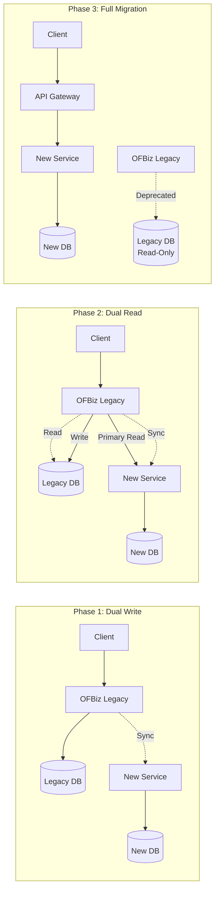

## Verwendung der Visualisierungen

Diese Diagramme können in verschiedenen Tools gerendert werden:

1. **GitHub/GitLab**: Unterstützen Mermaid nativ in Markdown
2. **VS Code**: Mit Mermaid-Extension
3. **Confluence**: Mit Mermaid-Plugin
4. **Online**: https://mermaid.live/

## Neo4j Cypher Queries für weitere Analysen

```cypher
// 1. Detaillierte Abhängigkeiten zwischen zwei Modulen
MATCH (source:Package)-[:CONTAINS*]->(st:Type)-[d:DEPENDS_ON]->(tt:Type)<-[:CONTAINS*]-(target:Package)
WHERE source.fqn STARTS WITH 'org.apache.ofbiz.order'
  AND target.fqn STARTS WITH 'org.apache.ofbiz.product'
RETURN st.name as orderClass, 
       tt.name as productClass,
       st.fqn as orderFQN,
       tt.fqn as productFQN
ORDER BY orderClass
LIMIT 50

// 2. Zentrale Klassen (Hub-Klassen)
MATCH (t:Type)
WHERE t.fqn STARTS WITH 'org.apache.ofbiz'
WITH t, 
     SIZE([(t)<-[:DEPENDS_ON]-() | 1]) as incomingDeps,
     SIZE([(t)-[:DEPENDS_ON]->() | 1]) as outgoingDeps
WHERE incomingDeps > 10
RETURN t.name, t.fqn, incomingDeps, outgoingDeps
ORDER BY incomingDeps DESC
LIMIT 20

// 3. Isolierte Module (wenig Abhängigkeiten)
MATCH (p:Package)
WHERE p.fqn =~ 'org\\.apache\\.ofbiz\\.[^.]+$'
WITH p.fqn as module
MATCH (source:Package)-[:CONTAINS*]->(st:Type)-[:DEPENDS_ON]->(tt:Type)<-[:CONTAINS*]-(target:Package)
WHERE source.fqn STARTS WITH module
  AND target.fqn STARTS WITH 'org.apache.ofbiz'
  AND NOT target.fqn STARTS WITH module
WITH module, COUNT(DISTINCT target) as externalDeps
RETURN module, externalDeps
ORDER BY externalDeps ASC

// 4. Shared Kernel Kandidaten
MATCH (t:Type)<-[:DEPENDS_ON]-(dependent:Type)<-[:CONTAINS*]-(p:Package)
WHERE p.fqn STARTS WITH 'org.apache.ofbiz'
  AND p.fqn =~ 'org\\.apache\\.ofbiz\\.(accounting|order|product|party|shipment).*'
WITH t, COLLECT(DISTINCT SPLIT(p.fqn, '.')[3]) as modules
WHERE SIZE(modules) >= 3
RETURN t.fqn, modules, SIZE(modules) as moduleCount
ORDER BY moduleCount DESC
LIMIT 30

// 5. Package-Größen und Komplexität
MATCH (p:Package)-[:CONTAINS*]->(t:Type)
WHERE p.fqn =~ 'org\\.apache\\.ofbiz\\.[^.]+$'
WITH p.fqn as module, COUNT(DISTINCT t) as typeCount
MATCH (p2:Package {fqn: module})-[:CONTAINS*]->(t2:Type)-[d:DEPENDS_ON]->()
WITH module, typeCount, COUNT(d) as totalDeps
RETURN module, typeCount, totalDeps, 
       toFloat(totalDeps) / typeCount as avgDepsPerType
ORDER BY avgDepsPerType DESC
```
